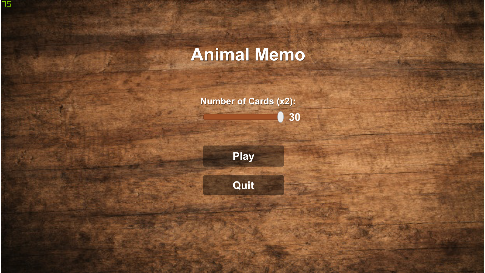
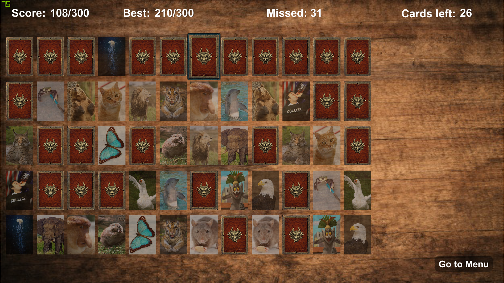

# Memo-Game
Simple memo game to train your memory.
Rules are simple, at begining all cards are hidden and your job is to find pairs of animal images. 
The more cards, the harder the game.
Every card count has it's own score record which is persistent on exiting and running the game.

